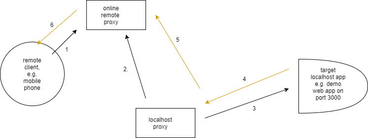

# backend-reverse-proxy

Intended for accessing web applications running on development machines at localhost from remote clients such as mobile devices, virtual machines, etc.

In general, serves as an HTTP reverse proxy together with [backend-local-forward-proxy](https://github.com/aaronicsubstances/backend-local-forward-proxy) through long polling. So remote client (e.g. mobile device) makes HTTP requests to running instance of this project, which then gets transferred to [backend-local-forward-proxy](https://github.com/aaronicsubstances/backend-local-forward-proxy) for delivery to actual target web appliation.

## Setup

Launch from [example](example) directory with 
```
npm install
npm start
```

See .env.sample for environment variables which can be used to configure the application. The most important of them are

   * REQUEST_TIMEOUT_MILLIS. default is 20 seconds.
   * POLL_WAIT_TIME_MILLIS. default is 5 seconds.

**In general, it is expected that this project will be hosted on the Internet, so that all manner of remote clients can assess it.**

## Architecture




   1. remote client makes http request to running instance of backend-reverse-proxy on the Internet. reverse-proxy records http request and puts remote client on hold, waiting for local-forward-proxy to pick it up for processing.
   
   2. backend-local-forward-proxy continuously polls reverse-proxy, and eventually discovers and picks up http request headers and body from remote client.

   3. local-forward-proxy makes normal http request to target localhost service (the one remote client actually wants to reach but cannot reach directly) using received request headers and body.

   4. target localhost service responds to local-forward-proxy with http response headers and body.
 
   5. local-forward-proxy makes normal http request to reverse-proxy, and transfers received response headers and body to it.

   6. reverse-proxy wakes up remote client and transfers received response headers and body to it as its final response.

Remote clients make http request to backend-reverse-proxy deployments at paths with prefix/base of the form **/main/\[target_app_id\]**, where *target_app_id* is a uuid/guid configured at a running backend-local-forward-proxy instance to map to a given target app base url.

By this arrangement, a single online remote proxy deployment can serve multiple localhost proxies, as long as each localhost proxy is careful to use a different set of uuids/guids.
